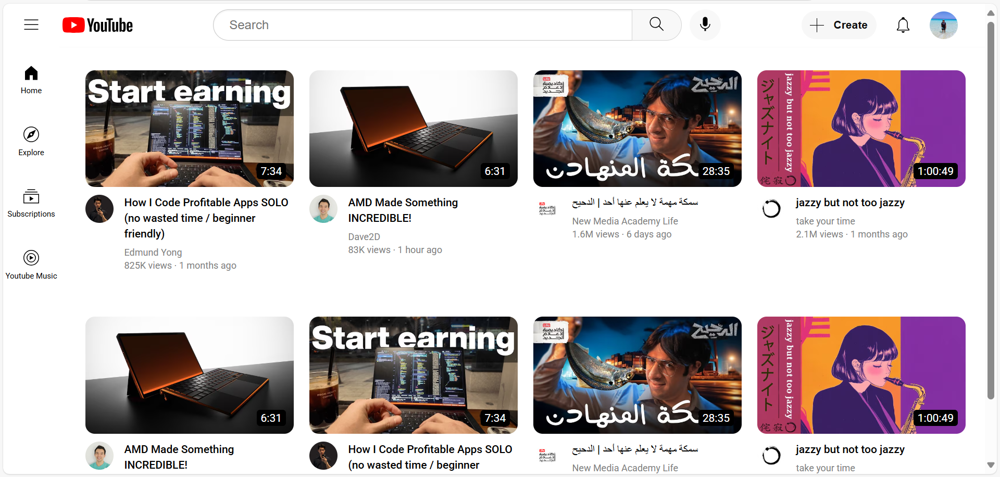

# YouTube Clone

A responsive YouTube clone built using HTML and CSS, replicating key features of YouTube's interface with modern styling and layout techniques.



**Live Demo:** [View Demo](https://abdoxcode.github.io/Youtube-clone/) 

## Features

- **Responsive Design**: Adapts to mobile, tablet, and desktop screens.
- **Header Section**:
  - search bar with voice search button
  - Navigation icons (Create, Notifications, Profile)
- **Sidebar Menu**: Fixed navigation with icons for Home, Explore, Subscriptions, and YouTube Music.
- **Video Grid**: 
  - Dynamic grid layout (4 columns on desktop, 3 on tablets, 2 on mobile)
  - Video thumbnails with duration timestamps
  - Channel profiles and video metadata (title, author, views, upload date)
- **Hover Effects**: Interactive elements with hover states for better UX.
- **Clean Styling**: Modern design with Roboto font and YouTube-like spacing.

## Technologies Used

- **HTML5**: Semantic structure
- **CSS3**:
  - Flexbox and Grid for layouts
  - Media queries for responsiveness
  - CSS variables and modern selectors
  - Google Fonts (Roboto)
- **Icon System**: SVG-based icons for crisp display

## Installation

1. Clone the repository:
   ```bash
   git clone https://github.com/AbdoXCode/youtube-clone.git
